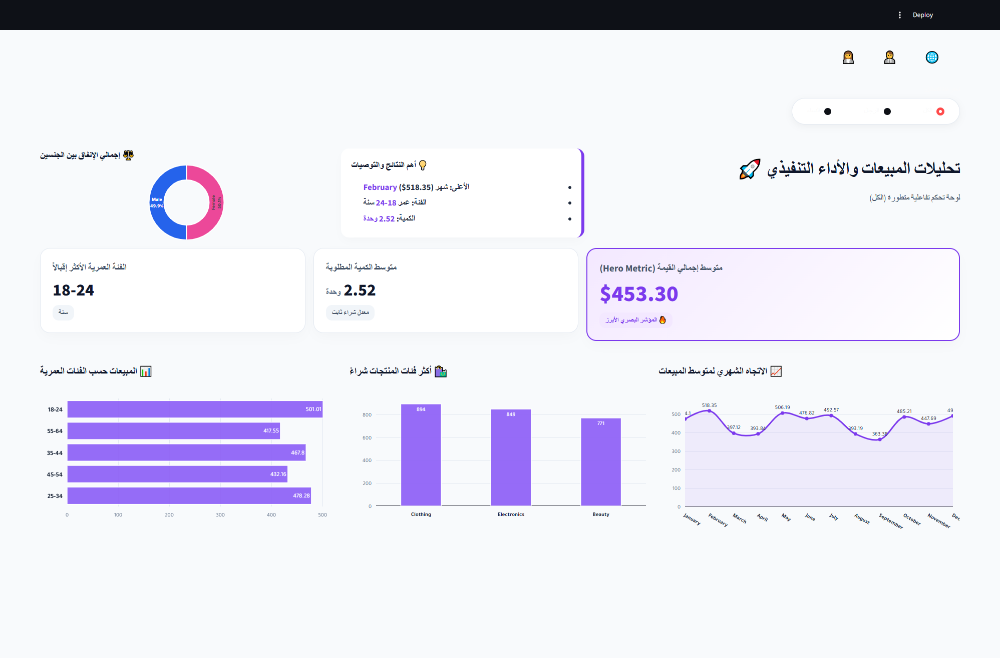
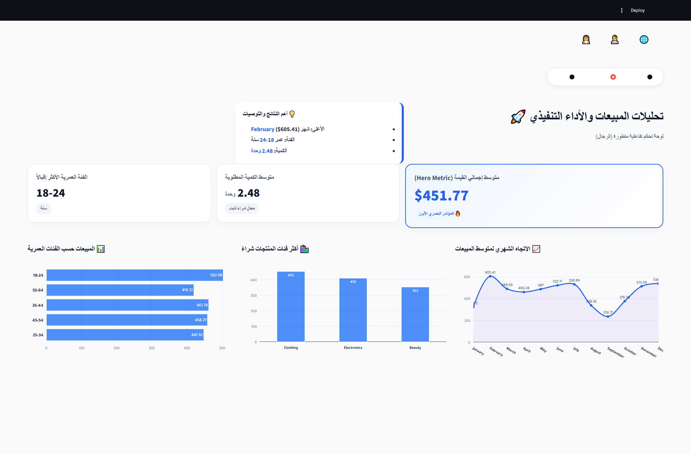
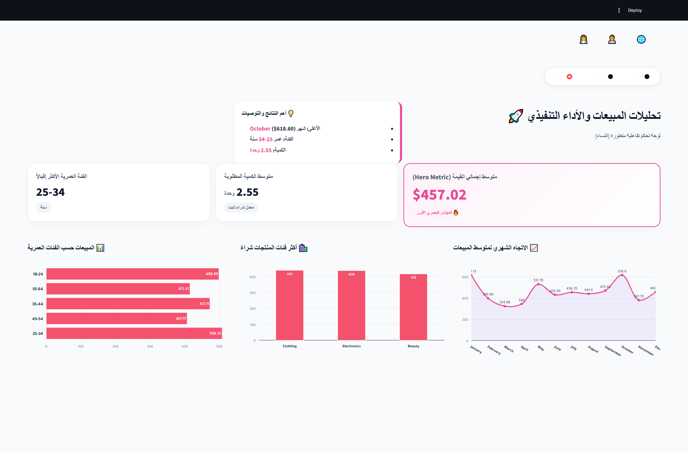

مشروع لتحليل بيانات المبيعات باستخدام SQL وPython وعرض النتائج من خلال Dashboard تفاعلي باستخدام Streamlit.

📌 التحليل يشمل
المبيعات حسب الأشهر.
المبيعات حسب الفئات العمرية.
مقارنة المبيعات بين الرجال والنساء.
تحليل الكميات وفئات المنتجات.
🛠️ الأدوات المستخدمة

SQL | Python | Pandas | Plotly | Streamlit | MySQL

📊 Dashboard

📁 محتويات المشروع
app/ — ملفات الـDashboard.
sql/ — استعلامات SQL.
docs/ — صور الـDashboard.
requirements.txt — المكتبات المطلوبة.

مشروع ضمن ملف أعمالي في تحليل البيانات.

🤖 ملاحظة

تم استخدام أدوات الذكاء الاصطناعي (AI) للمساعدة في تصميم وتطوير واجهة الـDashboard، بينما تم تنفيذ تحليل البيانات وكتابة استعلامات SQL واستخراج النتائج من قبلي.